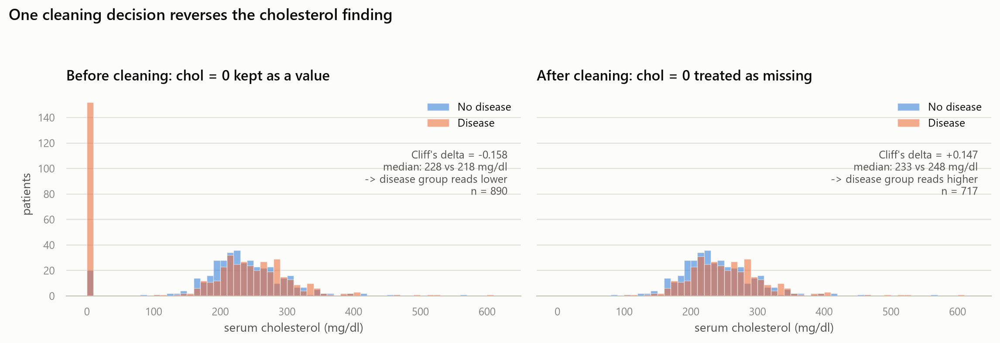
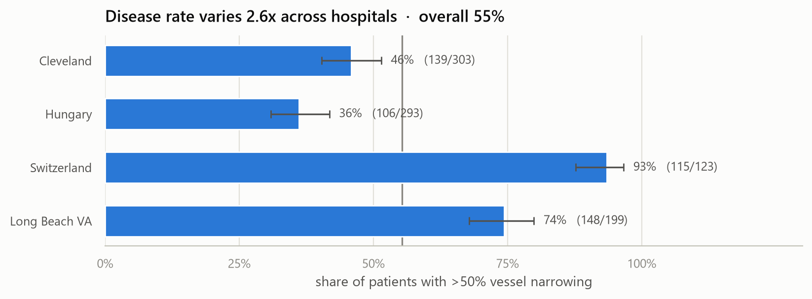
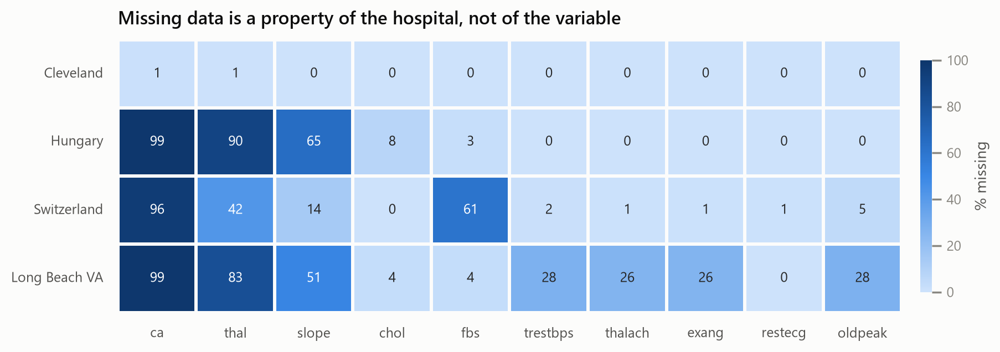
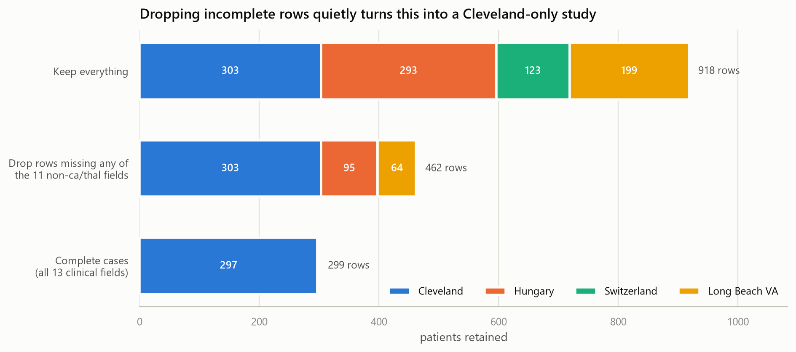
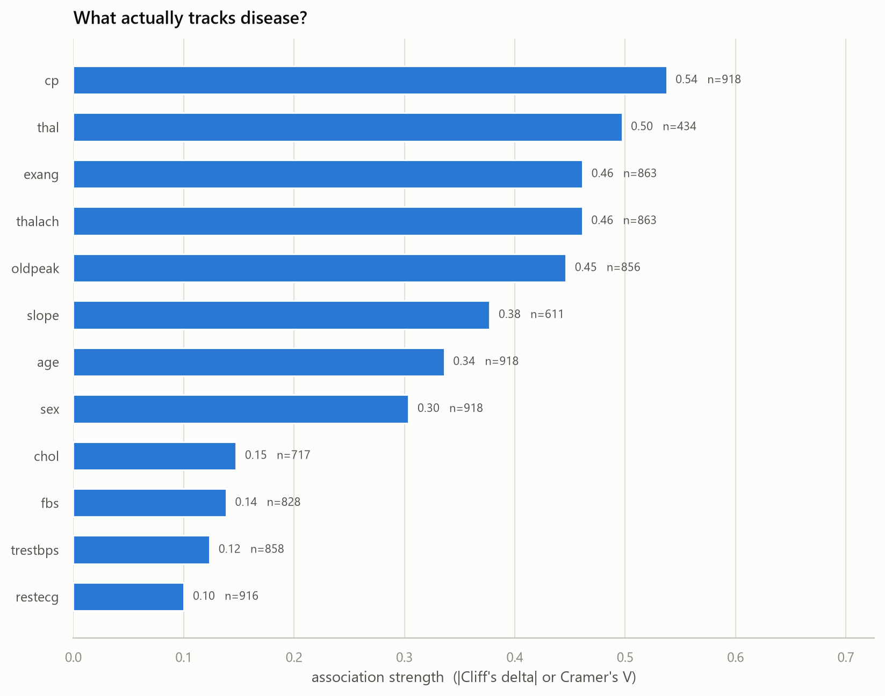

# 🔎 InsightLab — Who actually has heart disease, and can we trust the data that says so?

An end-to-end exploratory data analysis of the **UCI Heart Disease** databases: 
918 patients, four hospitals, thirteen clinical measurements, one binary question.

**→ [Read the notebook](notebooks/eda.ipynb)** · [Dataset card](DATASET_CARD.md)

This is an analysis, not a tutorial. Every section states the question it answers,
shows the evidence, and commits to a conclusion — including where the data does not
support one.

---

## The headline finding

**One cleaning decision reverses a published-looking result.**  

172 patients in this dataset have a serum cholesterol of `0 mg/dl`. That is not a
measurement — it is a missing value wearing a number's clothes, and it is the "not
recorded" code for two of the four hospitals. Because those hospitals are also the
*sickest* in the dataset, the fake zeros land almost entirely in the diseased group:

| | n | median (healthy → diseased) | Cliff's δ | Reads as | 
|---|---|---|---|---|
| Zeros kept as data | 890 | 228 → 218 mg/dl | **−0.158** | cholesterol is *protective* (p = 4.9e-05) |
| Zeros treated as missing | 717 | 233 → 248 mg/dl | **+0.147** | cholesterol is a *risk factor* (p = 6e-04) |



Both results are statistically significant. Both would survive a careless review. One
is an artefact of a missing-value code, and no amount of downstream statistical rigour
would have caught it — only looking at the data would.

*This is the entire argument for doing EDA before modelling.*

---

## Questions asked

| # | Question | Answer |
|---|---|---|
| Q1 | Is the data healthy, and can the four sites be pooled? | Only with `site` carried through as a confounder — disease rates span 36% to 94% |
| Q2 | What separates diseased from healthy patients? | The exercise test, decisively. Not the classic risk-factor panel |
| Q3 | Does cholesterol behave as the textbook says? | Only after cleaning, and only weakly (δ = +0.147) |
| Q4 | Is maximum heart rate just age in disguise? | No — the effect survives in all four age bands |
| Q5 | Does the sex difference survive age? | The direction does; the magnitude is not estimable here |
| Q6 | What must a modeller know first? | Four things that would each quietly break a model — see below |

---

## Key findings 

### 1. The four hospitals are not interchangeable



A 2.6× spread in disease rate, from 36% (Hungary) to 94% (Switzerland). Switzerland's
rate reflects a stricter referral threshold, not Swiss cardiac health. The sites also
differ in sex mix (68% to 97% male), mean age (47.8 to 59.4), and data completeness.

`site` is entangled with the clinical variables themselves — Cramér's V of **0.43**
with `restecg`, meaning the four hospitals graded resting ECGs differently. A model
given these columns without `site` will reconstruct it and partly learn *"which
hospital is this?"* instead of *"is this patient sick?"*

### 2. Missing data is a property of the hospital, not the variable 



Not random missingness — four different collection protocols. Hungary and Long Beach
VA almost never performed fluoroscopy (`ca` 99% missing); Switzerland skipped fasting
blood sugar for 61% of patients; Long Beach VA is missing ~28% of the entire exercise
test block together.

### 3. `dropna()` would silently turn this into a Cleveland-only study 



Of the 299 rows complete on all thirteen clinical fields, **297 are from Cleveland**.
One line of reflexive "cleaning" discards three hospitals and two thirds of the data,
and shifts the base rate from 55% to 47% — without printing a warning.

This project therefore **does not impute**. Every statistic is computed on the rows
where the relevant variable is present, and every table reports its own `n`.

### 4. Predictive power and availability pull in opposite directions 



The ranking splits into three clean tiers:

1. **Exercise-test variables** — `cp` 0.54, `thal` 0.50, `exang` 0.46, `thalach` 0.46,
   `oldpeak` 0.45, `slope` 0.38
2. **Demographics** — `age` 0.34, `sex` 0.30
3. **Resting risk factors** — `chol` 0.15, `fbs` 0.14, `trestbps` 0.12, `restecg` 0.10

Resting blood pressure has an **identical median** in both outcome groups. Meanwhile
`ca` — the strongest correlate in the dataset at ρ = +0.484 — is 66% missing, and
`thal` (V = 0.50) is 53% missing. The best signals come from invasive follow-up tests
that were only ordered for already-suspicious patients, largely at one hospital.

### 5. How a patient entered the dataset is a variable, and it is not recorded 

Patients reporting **no chest pain at all** have a 79.0% disease rate. Patients with
atypical angina have **13.9%**.

Taken naively this says chest pain protects you from heart disease. It does not — it
is referral bias made visible. To be sent for an invasive angiogram *without* the
classic presenting symptom, a patient needed some other compelling reason. The
asymptomatic group is pre-selected for high suspicion.

---

## Methodology

**Rank-based statistics throughout.** `chol` (skew 1.31) and `oldpeak` (zero-inflated)
are not normal, so the notebook uses Mann-Whitney U, Spearman ρ, and Cliff's δ rather
than t-tests and Pearson.

**Effect sizes over p-values.** At n ≈ 900 almost everything is "significant".
Continuous variables are scored with Cliff's δ and categoricals with bias-corrected
Cramér's V — both bounded 0–1, so they rank on one axis.

**Wilson score intervals** for proportions, because several subgroups are small and
Wald intervals misbehave near 0 and 1.

**Confounders tested, not assumed.** Where a finding could be a site or age artefact,
it is re-tested within strata (§9.1–9.3) rather than asserted away.

**Charts.** One validated categorical palette used in fixed slot order; sequential
(single-hue) for magnitude, diverging blue↔red with a neutral midpoint for signed
quantities. Adjacent-pair separation was checked against a colour-vision-deficiency
validator on the actual chart surface (worst adjacent CVD ΔE 9.1, normal-vision 22.9),
and every sub-3:1 slot carries direct value labels as relief.

---

## Repository layout  

```
InsightLab/
├── notebooks/
│   └── eda.ipynb          # the analysis — start here
├── src/
│   ├── data.py            # download, load, clean; run as `python -m src.data`
│   └── helpers.py         # statistics + every figure
├── data/
│   ├── raw/               # UCI archive (git-ignored, re-downloaded on demand)
│   └── heart_disease.csv  # cleaned, 918 x 16
├── figures/               # 12 generated PNGs
├── DATASET_CARD.md        # provenance, licence, known issues, appropriate use
├── requirements.txt
└── README.md
```

The cleaning lives in `src/data.py::clean` and returns an **audit log** of how many
values each step changed, printed in the notebook — so nothing happens to the data
invisibly.

---

## Reproducing 

```bash
git clone <this-repo>
cd InsightLab

python -m venv .venv
source .venv/bin/activate      # Windows: .venv\Scripts\activate
pip install -r requirements.txt

python -m src.data             # downloads UCI archive -> data/heart_disease.csv
jupyter lab notebooks/eda.ipynb
```

`src/data.py` caches the raw download, so the notebook re-runs offline. Executing it
top to bottom regenerates all twelve figures in `figures/`.

Tested on Python 3.11 with pandas 2.x.

---

## Dataset 

**UCI Heart Disease** (dataset 45), CC BY 4.0. Four databases collected 1988–1991 at
the Cleveland Clinic, the Hungarian Institute of Cardiology, University Hospitals
Zurich and Basel, and the Long Beach VA Medical Center.

> Janosi, A., Steinbrunn, W., Pfisterer, M., & Detrano, R. (1989). *Heart Disease*
> [Dataset]. UCI Machine Learning Repository. https://doi.org/10.24432/C52P4X

The UCI documentation carries an explicit request that publications name the
principal investigators; [`DATASET_CARD.md`](DATASET_CARD.md) does so, along with
collection conditions and known data-quality issues.

**This data must not be used clinically.** It is 35+ years old, 79% male, describes
referred cardiology patients at four specific hospitals, and its 55% base rate is a
referral hit rate rather than a population prevalence.

---

## Limitations 

- **Not a general population** — every patient was referred for angiography.
- **Collected 1988–1991** — diagnostic thresholds, imaging and treatment have moved.
- **Missing data is informative and unimputed** — statistics rest on varying subsets,
  so figures are not strictly comparable across variables.
- **Severity collapsed** — `num` 1–4 became one class, discarding gradation that is
  in any case inconsistent across sites.
- **Association, not causation** — and the strongest associations (`ca`, `thal`) are
  near-direct observations of the outcome, not independent risk factors.
- **Underpowered subgroups** — 193 women total, 15 in the oldest band; Switzerland
  contributes only 8 non-diseased patients.

## If this continued 

Model with **leave-one-site-out validation** — a random split leaks site structure.
Formally test whether the exercise-test effects are homogeneous across hospitals. And
treat missingness as a modelled mechanism rather than a nuisance: at Long Beach VA,
*not having done the exercise test* is itself a clinical decision that carries
information.
